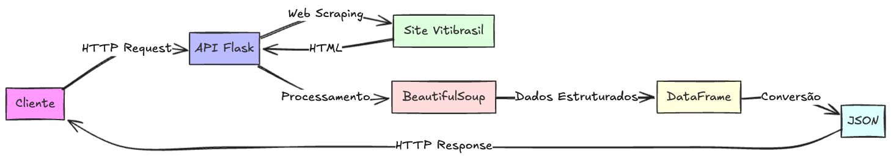
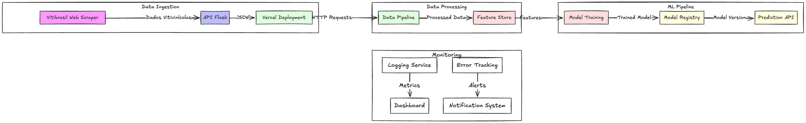

# Tech challenge 1 - Pós-Graduação em Engenharia de Machine Learning - FIAP

Esse projeto foi desenvolvido para o "tech challenge" da primeira fase da pós-graduação em Engenharia de Machine Learning da FIAP "Welcome to Machine Learning Engineering". Link do projeto: https://github.com/luis-fnogueira/tech-challenge-1.

O README da API pode ser encontrado em `vitibrasil_scraper/README.md` para descrição do projeto,
instruções de instalação, execução e testes.

A API aqui desenvolvida pode ser testada através de um link público https://tech-challenge-1-one.vercel.app/. As rotas estão especificadas no README mencionado acima.

## Arquitetura do projeto

O projeto consiste em fazer uma "raspagem" dos dados da Embrapa sobre viticultura no Rio Grande do Sul e retorná-los em formato JSON. Foi utilizada a linguagem Python com as bibliotecas Flask e BeautifulSoup, principalmente, para realizar a busca e apresentação dos dados.

Os dados apresentados podem ser utilizados para análise dados, criação de modelos preditivos, etc.

## Plano para fazer o deploy da API

### Arquitetura do sistema servindo de input para um modelo de ML

### Detalhamento da Arquitetura

1. **Data Ingestion Layer**
   - Web Scraper em Python para coletar dados da Vitibrasil
   - API Flask para expor os dados em formato JSON
   - Deploy na Vercel

2. **Data Processing Layer**
   - Pipeline de processamento de dados em Python
   - Transformação e limpeza dos dados
   - Feature Store para armazenamento das features processadas
   - Banco de dados PostgreSQL para persistência

3. **ML Pipeline**
   - Treinamento de modelos usando scikit-learn
   - Registro de modelos para versionamento
   - API de predição para servir as inferências
   - Cache de predições para otimização de performance

4. **Monitoring & Observability**
   - Sistema de logging centralizado
   - Dashboard para métricas de performance
   - Sistema de alertas para anomalias
   - Tracking de erros e exceções

### Cenário de Uso Proposto

O sistema será utilizado para prever a produção de uvas no Rio Grande do Sul com base em dados históricos. Este cenário é particularmente interessante porque:

1. **Impacto Econômico**: A viticultura é um setor importante para a economia do RS
2. **Complexidade Técnica**: Envolve séries temporais e múltiplas variáveis
3. **Aplicabilidade**: Pode auxiliar produtores e investidores na tomada de decisão